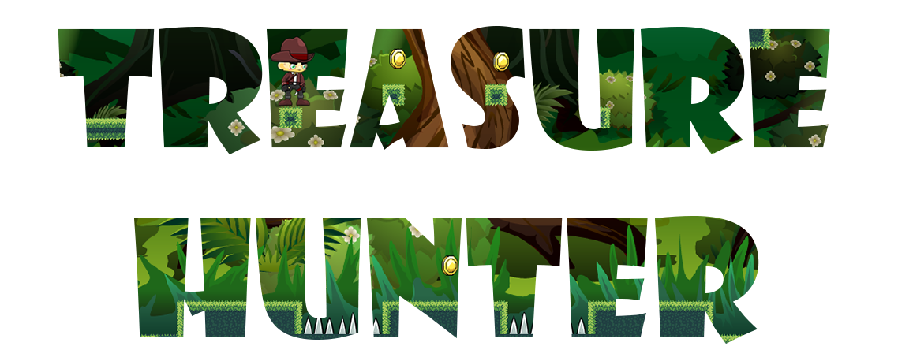
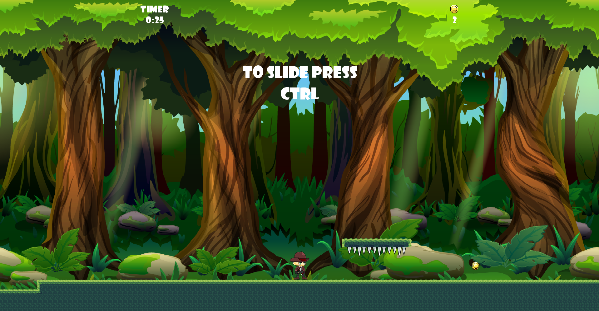

# Treasure Hunter

Videogioco platform realizzato mediante il linguaggio ad oggetti `Java`, in cui si impersonifica un cercatore di tesori che ha come obiettivo quello di scovare e raccogliere più monete possibili.

Il gioco ha un sistema di classifica `multigiocatore` per decretare il carcatore di tesori migliore.

## Galleria
</img> </img> 

## Presentazione
La presentazione del videogioco è disponibile al seguente link: [Treasure Hunter Presentazione](slide/MOSCA%20MICHELE%20-%20CAGNINA%20GIANLUCA.pdf)

## Credits
L'idea di progetto nasce con la finalità di sostenere l'esame di Programmazione ad Oggetti del professore Nicola Bicocchi. Realizzato da Michele Mosca e Gianluca Cagnina.